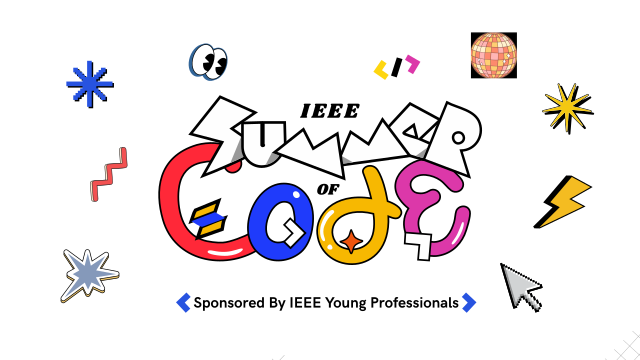

    
    <h1>IEEE Summer of Code</h1>

    Welcome to the official repository for the <strong>IEEE Summer of Code</strong>!

    This is your chance to <strong>code, learn, and grow</strong> over the summer. Whether you're a beginner or a seasoned developer, IEEE Summer of Code offers exciting projects, mentorship, and a platform to showcase your skills.

    <h2>Ready to get started?</h2>
    

    Stay tuned for updates, project lists, and mentor announcements!

    Feel free to explore the codebase, report issues, or contribute!

    <h3>ISOC Socials</h3>
    
    
    

    <h3>IEEE CS BMSIT&M Socials</h3>
    
    
    

    <strong>Happy coding! 💙</strong> 
    — Team IEEE SoC

